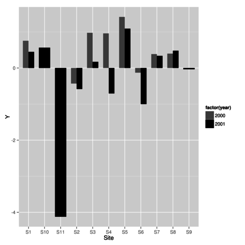

% Introducción a R
% Curso Jóvenes AIL
% Bloque IV

#

## ¿Qué es **R**?

> [R](http://cran.r-project.org) es un **lenguaje de programación** principalmente orientado al análisis estadístico y visualización de información cuantitativa y cualitativa y publicado como **software libre** con licencia GNU-GPL.

## ¿Qué es **R**?


## [Librerías](http://cran.r-project.org/web/packages/available_packages_by_date.html)

* Las funciones se agrupan por paquetes o librerías
* Las Funciones más habituales se incluyen por defecto en R
* Las librerías se pueden instalar y cargar fácilmente

## Librerías

```r
library() 
install.packages('labdsv')
library(labdsv)
library(help=labdsv)
```

Hay conjuntos de librerías según su temática llamadas [Task Views](http://cran.r-project.org/web/views)

#

## Fuentes de información

* [Manual introductorio](http://cran.r-project.org/doc/manuals/R-intro.html)
* [Manuales oficiales](http://cran.r-project.org/manuals.html)
* [Manuales externos](http://cran.r-project.org/other-docs.html)
* [Listas de correo](http://www.r-project.org/mail.html)
* [R-bloggers](http://www.r-bloggers.com)
* [Comunidad R-Hispano](http://r-es.org/)
* [Apuntes de Luís Cayuela](http://luiscayuela.blogspot.com.es/)


## Ayuda

```r
help(anova)
help.start() ## *Ayuda GUI
RSiteSearch('anova')
help('+') ## Ayuda sobre operadores
help.search('linear model') ## Búsqueda de palabras clave
```

#

## Elementos de R

**Variables**

```r
setwd('...\cursoail')
a <- 3.25 
nombre <- 'Pepe'
a = 3.25 
```

**Operadores**

```r
a == 3.25 
a == 6 
nombre !='Juan'
nombre == 'Pepe'
a != 2
5 < 6
10 >= 5
```


## Elementos de R

**Variables**

```r
fecha1 <- as.Date('2000-01-01')
fecha2 <- as.Date('2000-01-01')+2 
```

**constantes**

```r
NULL ## vector, matriz,  vacíos
NA ## celdilla sin valor 
NaN ## valor no numérico  (ejm. 1/0=inf)
pi ## ya definidas

```


## Operadores aritméticos

```r
1+2
1-2
5/3
2^{3}
sqrt(10)
```

## Objetos en R  

**Vectores**

```r
a<-NULL # vector vacío
a<-1:10 # 1 2 3 4 5 6 7 8 9 10
c<-seq(1,10,by=0.5) # 1 1.5 2 ... 9.5 10
d<-c(0,1,1,2,3) # 0 1 1 2 3
e<-c('b1','b2','b3') #  'b1' 'b2' 'b3'
f<-rep(5,6) # 5 5 5 5 5 5
d[1] # el primer dato del vector 0
d[-1] # todos los datos del vector menos el primero 1 1 2 3
```

## Objetos en R

**Matrices**

```r
matrix(1:12,3,4)->x # valores del 1 al 12, 3 filas y 4 columnas 
rbind(1:5, 11:15, 21:25) # unir filas
cbind(1:5, 11:15, 21:25) # unir columnas
x[1:2,2:3] # selección de valores: filas 1 y 2 columnas 2 y 3
x[,-2] # selección de toda la matriz excepto la columna 2
t(x)
```

## Objetos en R

**Data frames**

```r
x<-matrix(1:30,10) ## valores del 1 al 30 agrupados de 10 en 10 (10 filas 3 columnas)
plot(x) # dibujar la matriz
x<-as.data.frame(x) ## convertir a 'data.frame'
plot(x) 
names(x) # nombres de las variables
x[2,1] # seleccionar un elemento (fila 2 columna 1)
x$V1 # seleccionar una variable (columna 1)
```

## Gestión del espacio de trabajo

```r
data(cars)## activar datos ejemplo
ls() 
rm() 
rm(a) 
rm(list=ls())
```

#

## Importar y ver mis datos

```r
iris<-read.table('iris.csv',sep=';',dec=',',header=T)
iris
head(iris) 
tail(iris) 
dim(iris) 
names(iris)
attach(iris)
by(Sepal.Length, Species, summary)
head(Sepal.Length)
detach(iris)
```

## Primeros pasos

```r
colnames(x) 
colnames(x)<-c('B1','B2','B3')
rownames(x)
rownames(x)<-LETTERS[1:10]
```

## Seleccionar de mis datos

```r
iris[,1] 
iris[,-1]
iris[1:3,] 
iris[-1:-3),]
iris[,c(1,3)] 
iris[,-c(1,3)] 
```

## Estadísticos básicos

```r
table(Species) # Tabla de contingencia
summary(iris)
summary(cars)
sd(iris$Sepal.Length)
```

## Primeros pasos

```r
lm_pl_sl<-lm(Petal.Length ~ Sepal.Length)
plot(lm_pl_sl) 
summary(lm_pl_sl) 
names(lm_pl_sl) 
cbind(iris,lm_pl_sl$fitted.values)->mi.iris 
head(mi.iris) 
write.table(mi.iris,'mi.iris.csv',sep=';',dec=',',col.names=TRUE,row.names=FALSE)
```

#

##  Funciones 

nombre_fun<-function(argumentos){expresión}

```r
di.hola.mundo<-function() {print('¡Hola Mundo!')}
di.hola.mundo()
```

##  Funciones 

```r
a.euros<-function(pesetas) {pesetas/166.386}
a.euros(1000)
a.pesetas<-function(euros) {euros*166.386}
a.pesetas(6)
```

##  Funciones 

¿Cómo se haría la función 'Área del triángulo'?

##  Funciones 

¿Cómo se haría la función 'Área del triángulo'?

```r
area.triangulo<-function(b,h) {b*h/2}
area.triangulo(b=3,h=5)
area.triangulo(3,5)
area.triangulo()
```

##  Funciones 

¿Cómo se haría la función 'Área del triángulo'?

```r
area.triangulo2<-function(b=3,h=5) {b*h/2}
area.triangulo2()
area.triangulo2(b=4)
```

#

## Gráficos 

```r
plot(x=1:10, y=1:10)
plot(x=1:10, y=1:10,type='l')
plot(x=1:10, y=1:10,type='o')
```

## Gráficos 

```r
plot(x=1:10, y=1:10,xlab='eje X',ylab='eje Y')
plot(x=1:10, y=1:10,main='Título')
plot(x=1:10, y=1:10,xlab='eje X',ylab='eje Y',axes=FALSE)
plot(x=1:10, y=1:10,xlim=c(1,3),ylim=c(1,5))
```

## Leyendas 

```r
attach(iris)
plot(Sepal.Length,Petal.Length,col=Species,xlab='Long. Sépalo',ylab='Long. Pétalo')
legend(7,2,col=c(1:3),pch=1,legend=unique(Species))
```

## Leyendas


## Histogramas 

Índice de elementos de la especie versicolor

```r
indice_versicolor<-Species=='versicolor' 
hist(Sepal.Length[indice_versicolor])
```

## Histogramas


## Gráficos agrupados ##

Definir plantilla

```r
par(mfrow=c(2,1))
hist(Sepal.Length)
hist(Sepal.Length[indice_versicolor])
```

## Gráficos agrupados


## Guardar gráficos

```r
jpeg('histogramas.jpg')
par(mfrow=c(2,1))
hist(Sepal.Length)
hist(Sepal.Length[indice_versicolor])
dev.off() # Cerrar el dispositivo gráfico o imagen
```

## Diagramas de cajas

```r
boxplot(Sepal.Length ~ Species)
```


## Diagramas de cajas

```r
boxplot(Sepal.Length ~ Species,las=2)
```


## Diagramas de barras

```r
barplot(bar1_data$value, names.arg=factor(bar1_data$Site))
```

## Diagramas de barras


## Gráficos circulares

```r
pie(table(Species),labels=levels(Species),main='Especies',col=4:7)
```


## Gráficos de regresión

```r
plot(Sepal.Length,Petal.Length,col=Species,main='Regresión',xlab='Long. Sépalo',ylab='Long. Pétalo')
abline(lm_pl_sl,col=4,lwd=2)
legend(6.5,3,col=c(1:3),pch=1,legend=unique(Species),bty='n')
legend(6.3,2.2,col=4,lty=1,lwd=2,legend=c('Línea de regresión'),bty='n')
```

## Gráficos de regresión


## Gráficos de regresión II

```r
plot(lm_pl_sl) # Gráficos secuenciales
par(mfrow=c(2,2)) # Agrupar gráficos
plot(lm_pl_sl)
```

## Gráficos de regresión II


#

## Gráficos avanzados con ggplot2

[Manual de ggplot2 online](https://ggplot2.tidyverse.org/reference/)

## Regresión lineal 

```r
lm_pl_sl<-lm(Petal.Length ~ Sepal.Length)
require(ggplot2)
c <- ggplot(iris, aes(y=Petal.Length, x=Sepal.Length))
c + stat_smooth(method=lm, colour = "black") + geom_point(aes(col=factor(Species))) 
ggsave('iris_lm.png') # guardar gráfico
```

## Regresión lineal


## Gráfico de barras 

```r
require(ggplot2)
c <- ggplot(bar1_data, aes(x=factor(Site),y=value))
c + geom_bar(stat="identity")
ggsave('bar1.png')
```

## Gráfico de barras 


## Gráfico de barras agrupadas 

```r
require(ggplot2)
qplot(factor(Site),value,data=bar2_data,geom='bar',stat='identity',position='dodge',fill=factor(year),xlab="Site", ylab="Y",width=0.7)+scale_fill_grey(start=0.5,end=0)
ggsave('bar2.png')
```

## Gráfico de barras agrupadas 



## Preparar datos para ggplot2

```r
library(reshape)
data_ggplot2<-melt(data,id=c('site'))
data_ggplot2
```

#

## ¿Cómo son tus datos?


